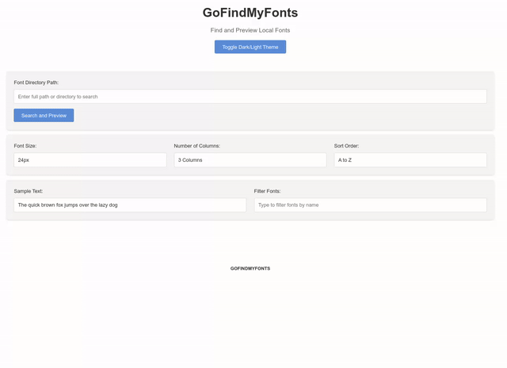

# GoFindMyFonts

GoFindMyFonts is a local Go-based web application that helps you discover, preview, and manage fonts on your system. This tool allows you to browse your local font files, generate previews, and convert fonts to both True Type Fonts (TTF) and Web Open Font Format 2.0 (WOFF2) formats. It's especially useful for managing large font collections and finding the ideal font for your projects.

 

## Features

- 🔍 Scan and discover fonts in specified directories
- 🔄 Support for TTF, OTF, WOFF, and WOFF2 formats
- 👀 Real-time font preview generation
- ✏️ Customizable preview text
- 📏 Adjustable font size
- 🔄 Format Conversion (uses Google WOFF2 Tools)
- 💫 Convert TTF/OTF files to WOFF2 for web optimization
- 📦 Cached conversion results for better performance
- 🌓 Dark/light theme toggle
- ⚡ Fast, concurrent font processing
- 🔍 Real-time font search and filtering
- ↕️ Customizable grid layout (1-4 columns)
- 🔤 Alphabetical sorting (A-Z, Z-A)
- 📥 Batch download all fonts as a ZIP file

## Prerequisites

Before installing the application, ensure you have:

- Go 1.23.4 or later (https://go.dev/doc/install).
- WOFF2 Tools (`woff2_compress` and `woff2_decompress`) (https://github.com/google/woff2)

## Installation

### Option 1 Download the pre-built Binary files from [Releases](https://github.com/bradsec/gofindmyfonts/releases)

```bash
# You will need to make the binary executable on macOS and Linux:

# Linux
chmod +x gofindmyfonts-linux-amd64
./gofindmyfonts-linux-amd64

# macOS
chmod +x gofindmyfonts-darwin-amd64 
./gofindmyfonts-darwin-amd64 

# Windows just open run the executable 
gofindmyfonts-windows-amd64.exe 


  ██████╗  ██████╗     ███████╗██╗███╗   ██╗██████╗                  
 ██╔════╝ ██╔═══██╗    ██╔════╝██║████╗  ██║██╔══██╗                 
 ██║  ███╗██║   ██║    █████╗  ██║██╔██╗ ██║██║  ██║                 
 ██║   ██║██║   ██║    ██╔══╝  ██║██║╚██╗██║██║  ██║                 
 ╚██████╔╝╚██████╔╝    ██║     ██║██║ ╚████║██████╔╝                 
  ╚═════╝  ╚═════╝     ╚═╝     ╚═╝╚═╝  ╚═══╝╚═════╝                  
																		
 ███╗   ███╗██╗   ██╗    ███████╗ ██████╗ ███╗   ██╗████████╗███████╗
 ████╗ ████║╚██╗ ██╔╝    ██╔════╝██╔═══██╗████╗  ██║╚══██╔══╝██╔════╝
 ██╔████╔██║ ╚████╔╝     █████╗  ██║   ██║██╔██╗ ██║   ██║   ███████╗
 ██║╚██╔╝██║  ╚██╔╝      ██╔══╝  ██║   ██║██║╚██╗██║   ██║   ╚════██║
 ██║ ╚═╝ ██║   ██║       ██║     ╚██████╔╝██║ ╚████║   ██║   ███████║
 ╚═╝     ╚═╝   ╚═╝       ╚═╝      ╚═════╝ ╚═╝  ╚═══╝   ╚═╝   ╚══════╝
																		
```

### Option 2 Clone and Build

- Clone the repository:
```bash
git clone https://github.com/bradsec/gofindmyfonts.git
cd gofindmyfonts
```

- Install dependencies:
```bash
go mod tidy
```

- Build the application:
```bash
go build -o gofindmyfonts cmd/server/main.go
```


## Notes
- The application will automatically open in your default web browser. By default, it runs on port 8080. Alternatively you an manually launch a browser and type the address: http://localhost:8080

- The application will create two working directories `static` and `logs` directory where ever the executable was launched.

## Acknowledgments

- Google [WOFF2 Tools](https://github.com/google/woff2) for font conversion